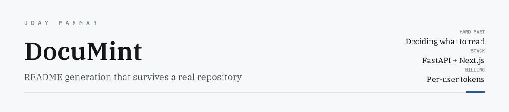
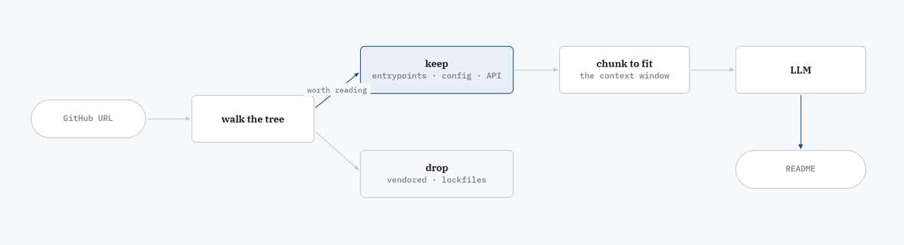

<picture>
  <source media="(prefers-color-scheme: dark)" srcset="assets/banner-dark.png">
  <source media="(prefers-color-scheme: light)" srcset="assets/banner-light.png">
  
</picture>

<p>
  
  
  
  
  <a href="https://uday-parmar.vercel.app/work/documint"></a>
</p>

Paste a GitHub link, get a README that actually describes the repository.

---

## The hard part isn't generation

Every README generator works on a toy repo and falls over on a real one, because real
repositories **do not fit in a context window**. The problem is not writing prose — it is
deciding what the model gets to read.

<picture>
  <source media="(prefers-color-scheme: dark)" srcset="assets/flow-dark.png">
  <source media="(prefers-color-scheme: light)" srcset="assets/flow-light.png">
  
</picture>

The reader and the chunker are the project. Everything else is plumbing around that decision.

## The rest of it

**FastAPI backend, Next.js frontend.** Users authenticate and manage their own API keys, so
they supply their own model access.

**Per-user token accounting.** The only way a tool wrapping a paid model stays solvent is
knowing who spent what. The ledger is not an analytics nicety; it is the business model.

**Tone presets** — professional, startup, meme. The README a company wants and the one a side
project wants are not the same document.

## Layout

```
backend/            FastAPI
  services/         generation, auth
  utils/
    reader.py       context-aware code reader  ← decides what matters
    chunker.py      splits what survives       ← makes it fit
    parser.py
  routers/          API + auth endpoints
  models/           user, api_key
frontend/           Next.js App Router
```

---

<sub>Built by <a href="https://uday-parmar.vercel.app">Uday Parmar</a></sub>
